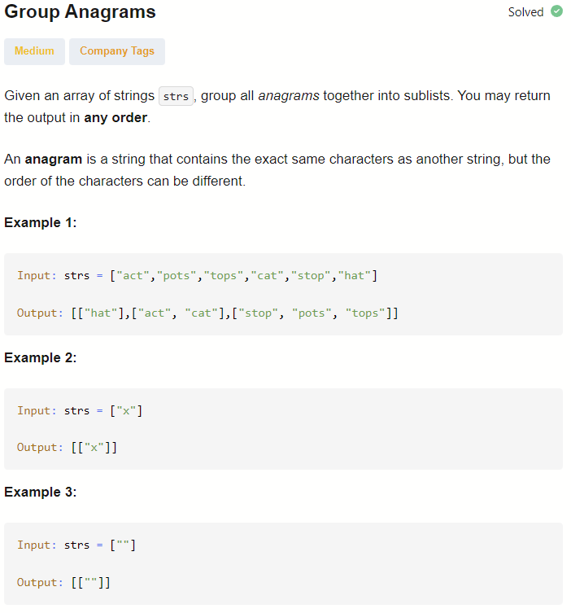

# STL Assignment - multimap

# multimap STL Container

## Introduction

multimap is an associative container in the C++ Standard Template Library (STL), defined in the <map> header. It stores key-value pairs sorted by keys, allowing duplicate keys (unlike map). Internally implemented as a self-balancing binary search tree (typically Red-Black Tree), it provides logarithmic time complexity for insertion, deletion, and lookup operations. Elements are always sorted according to the key comparison function.

## Properties & Features

| Property | Description |
| --- | --- |
| **Ordered** | Elements automatically sorted by key |
| **Duplicate Keys** | Multiple elements can share the same key |
| **Key Immutability** | Keys cannot be modified after insertion |
| **Bidirectional Iterators** | Supports forward and backward traversal |
| **Time Complexity** | O(log n) for insert, delete, search |
| **Header** | <map> |

## Member Types

| Type | Description |
| --- | --- |
| key_type | The key type |
| mapped_type | The mapped value type |
| value_type | std::pair<const Key, T> |
| iterator | Bidirectional iterator |
| const_iterator | Constant bidirectional iterator |
| size_type | Unsigned integer type |
| difference_type | Signed integer type |

## Member Functions

### Iterators

| Function | Description | Returns |
| --- | --- | --- |
| begin() | Iterator to first element | iterator |
| end() | Iterator past last element | iterator |
| rbegin() | Reverse iterator to last element | reverse_iterator |
| rend() | Reverse iterator before first element | reverse_iterator |
| cbegin() | Const iterator to first element | const_iterator |
| cend() | Const iterator past last element | const_iterator |
| crbegin() | Const reverse iterator to last | const_reverse_iterator |
| crend() | Const reverse iterator before first | const_reverse_iterator |

### Capacity

| Function | Description | Returns |
| --- | --- | --- |
| empty() | Checks if container is empty | bool |
| size() | Returns number of elements | size_type |
| max_size() | Returns maximum possible size | size_type |

### Modifiers

| Function | Description | Returns |
| --- | --- | --- |
| insert(value) | Inserts element | iterator to inserted element |
| interst(hint, value) | Inserts with position hint | iterator  |
| insert(first, last) | Inserts range | void |
| emplace(args..) | Constructs element in-place | iterator  |
| emplace_hint(hint, args..) | Constructs in-place with hint | iterator  |
| erase(pos) | Removes element at position | iterator to next element |
| erase(key) | Removes all elements with key | size_type (count removed) |
| erase(first, last) | Removes range | iterator  |
| clear() | Removes all elements | void |
| swap(other) | Swaps contents with another multimap | void |
| extract(pos) | Extracts node  | node_type |
| merge(source) | Splices nodes from source  | void |

### Lookup

| Function | Description | Returns |
| --- | --- | --- |
| find(key) | Finds element with key | iterator (or end() if not found) |
| count(key) | Counts elements with key | size_type |
| contains(key) | Checks if key exists (C++20) | bool |
| lower_bound(key) | First element not less than key | iterator  |
| upper_bound(key) | First element greater than key | iterator  |
| equal_range(key) | Range of elements matching key | pait<iterator ,iterator > |

### Observers

| Function | Description | Returns |
| --- | --- | --- |
| key_comp() | Returns key comparison function | key_compare |
| value_comp() | Returns value comparison function | value_compare |
| get_allocator() | Returns allocator | allocator_type |

## Non-Member Functions

| Function | Description |
| --- | --- |
| operator==, ! = , <, < = , > , > =  | Lexicographical comparison |
| operator < = > | Three-way comparison |
| swap() | Specialization of swap |
| erase_if() | Erases elements matching predicate |

## Solved Problem



## Solution:

```cpp
class Solution {
public:
    vector<vector<string>> groupAnagrams(vector<string>& strs) {
        multimap<string, string> mMap;
        for(string item : strs){
            string s = item;
            sort(s.begin(), s.end());
            mMap.insert(make_pair(s, item));
        }

        vector<vector<string>> v;
        auto it = mMap.begin();
        while(it != mMap.end()){
            auto range = mMap.equal_range(it ->first);
            vector<string> temp;
            for(auto i = range.first; i != range.second; ++i){
                temp.push_back(i -> second);
            }
            v.push_back(move(temp));
            it = range.second;
        }
        return v;
    }
};

```